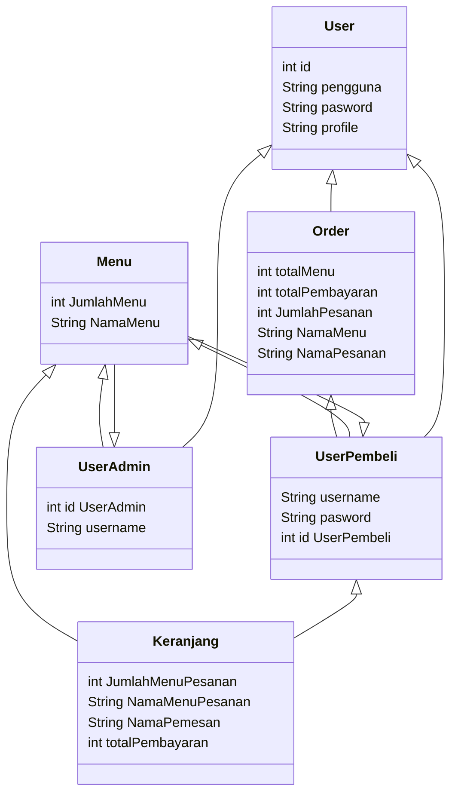
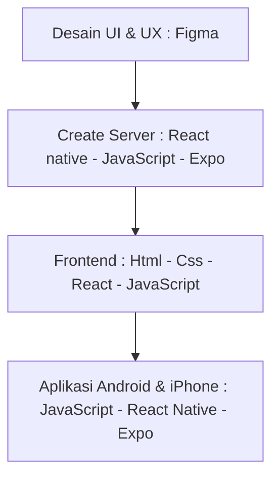

## Membuat App Coffe Shop ( "Nuku Coffe" ) Dengan React Native, Expo
Muhammad Rahardian Baihaqi -oct 25, 2023

## Intro
Coffe shop merupakan suatu tempat yang menyediakan berbaagai jenis kopi atau bahkan minuman atau makanan dengan menyediakan suasana santai, tempat yang nyaman, dan dilengkapi berbagai fasilitas yang menarik dan nyaman. Kata coffe sendiri berasal dari bahasa Prancis kata cafe yang artinya kopi, menoleh kebelakang indonesia merupakan salah satu negara dengan Budaya minum kopi yang banyak digemari atau bahkan sekarang menjadi trend di lingkungan masyrakat, Oleh karena itu peminataanya pun menjadi meningkat yakni 25%-30% pertahunnya, Sehingga Banyaknya Coffe shop/kedai kopi yang mulai padat antrian sehingga menimbulkan dampak mulai pelajar, mahasiswa, hingga orang tua banyak dari mereka yang ingin menikmati kopi lebih santai dan nyaman serta praktis dan tanpa ribet. Dalam kondisi saat ini banyak orang yang ingin membeli kopi dengan santai tanpa harus datang ke Coffe Shop tanpa antrian yang lama dan kurang maksimal dalam pelayananya. Maka dari itu saya membuat Coffe Shop App "Nuku Coffe" dengan adanya aplikasi ini yang tujuan untuk menuruti apa yang diinginkan user yaitu adalah user ingin menimati/membeli kopi tanpa harus ribet antri dan ribet dengan porsi yang sesuai keinginan, sehingga user bisa dapat menikmati kopi lebih cepat tanpa harus ribet antri dan tentunya lebih efisien menghemat waktu.

## Analysis Branding
Di tahap kedua kali ini kita akan mengeksplorasi branding dari aplikasi e-commerce yang dibuat, meliputi :
1. Merk : Nuku Coffe
2. Tagline : Pesan kopi tanpa ribet dan kapanpun dimanapun
3. Campaign : Bagaimana membuat aplikasi yang membuat penggunanya mampu membeli atau bahkan hanya melihat saja suatu menu yang akan dicari
4. Target user : 
   - Usia : 13+
   - Seseorang yang senang membeli suatu menu kopi
   - Seseorang yang ingin membeli menu kopi tanpa menunggu antrian dan ribet
   - Seseorang yang ingin memesan menu kopi secara online
   - Seseorang yang ingin menikmati kopi tanpa harus berada di coffe shop
   - Seseorang yang ingin membeli kopi dimanapun dan kapanpun
   - Seseorang penikmat menu kopi yang ingin mencoba teknologi pesan online
5. User experience theme :
   - Simple
   - Mudah
   - Elegan
   - Ramah
   - Warna  :
     **Hijau tua dan muda** salah satu warna yang identik dengan nuansa warna yang tenang, warna ini akan menyeimbangkan emosional, seperti cinta, kepercayaan, dan kasih sayang. warna        hijau untuk memberikan kesan segar dan dengan mudah kita bisa memberikan nuansa membumi dengan kombinasi warna hijau dan coklat.
     **Coklat** memberi kesan merek yang tenang dan bersahaja dan cukup mewakili produk kopi yang alami
     **Putih** salah satu juga warna yang menunujukkan murni dan keamanan warna ini juga dapat menunjukkan kebersihan, kemurnian, dan kemanan dan dapat digunkan untuk memicu kreatifitas.
     

## 2. Analysis User Story
Pada tahap ketiga kali ini mengeksplorasi kebutuhan prioritas dari pengguna agar kita wujudkan sebagai fitur dalam aplikasi web yg dibuat.

Sebagai | Saya ingin bisa | Sehingga | Prioritas
---|---|---|---
Pengguna| Memilih Menu | Pengguna memilih menu yang apa akan dibeli | ⭐⭐⭐⭐⭐
Pengguna| Memanambahkan nama | pengguna mendapatkan ucapan selamat datang | ⭐⭐⭐
Pengguna| Mengarah Tampilan Home | Pengguna mampu melihat tampilan di Home | ⭐⭐⭐
Pengguna| Memiliki profil | Pengguna mampu merubah profile yang diinginkan | ⭐⭐⭐⭐
Pengguna| Merubah lokasi tempat | Pengguna mampu melihat outlet dan lokasi coffe| ⭐⭐⭐⭐⭐
Pengguna| Melihat notifikasi lonceng | memudahkan untuk memberitahu informasi tentang app coffe | ⭐⭐⭐
Pengguna| Mencari menu | memudahkan memilih menu kopi yang akan dipesan | ⭐⭐⭐⭐⭐
Pengguna| Memilih kategori | memudahkan pemilihan kategori menu kopi | ⭐⭐⭐⭐
Pengguna| Menambahkan menu kopi | memudahkan pemilihan menu kopi untuk pesan secara banyak | ⭐⭐⭐⭐⭐
Pengguna| Melihat detail kopi | pengguna mampu melihat harga, size, level dan about | ⭐⭐⭐⭐
Pengguna| Melihat rating | memberitahu rating menu kopi | ⭐⭐⭐⭐
Pengguna| Menambahkan Favorite | pengguna dapat menyukai menu kopi | ⭐⭐⭐
Pengguna| Menambahkan ke keranjang | pengguna dapat mengetahui barang yang ditambahkan | ⭐⭐⭐⭐
Pengguna| Mengarah Tampilan Favorite | Pengguna mampu mengarah menu favorit dari pengguna | ⭐⭐⭐⭐
Pengguna| Mengarah Tampilan Keranjang | Pengguna mampu melihat menu kopi yang dimasukan keranjang oleh pengguna | ⭐⭐⭐⭐⭐
Pengguna| Mengarah Tampilan Profile | Pengguna mampu melihat profile dari pengguna | ⭐⭐⭐⭐⭐
Pengguna| Menambahkan berapa jumlah menu kopi yang dipesan | Pengguna mampu memesan berapa jumlah menu kopi yang ingin dipesan | ⭐⭐⭐⭐⭐
Pengguna| Mengetahui subtotal | memudahkan berapa harga menu kopi yang harus dibayarkan | ⭐⭐⭐⭐⭐
Pengguna| Memilih payment | Pengguna mampu memilih pembayaran lewat mana saja | ⭐⭐⭐⭐⭐
Pengguna| Membayarkan menu| Pengguna mampu membayar menu yang telah dipesan | ⭐⭐⭐⭐⭐

## 3. Struktur Data

## 4. Design : Arsitektur Sistem

Tahap ini kita merancang sebuah rangkaian teknologi yang digunakan/terdapat pada setiap komponen pembentukan aplikasi.

## 5. Teknologi, Library, dan Framework
Pada tahap ini saya menggunakan berbagai Teknologi seperti React Native, Expo untuk bagian create server. Figma dan Autodraw untuk UI & UX, untuk library menggunakan react navigation, JavaScript, Serta untuk running saya menggunakan framework React dan Expo. 

## 6. Desain User Experience dan User Interface

- Pada tahap ini kita mengeksplorasi alir interaksi pengguna yang paling praktis dan efektif
- Pada design yang saya gunakan adalah **AutoDraw untuk UX** sedangkan untuk **UI menggunakan Figma**.
- Desain diatas termasuk ke dalam low fidelity design dimana kualitas desainnya paling sederhana tapi cepat untuk dibuat untuk **UX**

## 7. Demonstrasi Video

https://youtu.be/MEN2hpYgGLE

## 8. Bagaimana mesin komputasi dan sistem operasi berperan dalam produk teknologi informasimu ?

Dalam konteks aplikasi kafe "Nuku Coffee", mesin komputasi dan sistem operasi memainkan peran krusial dalam menjalankan operasional sehari-hari serta meningkatkan efisiensi dan pengalaman pelanggan. Berikut adalah beberapa poin yang menjelaskan peran keduanya:
1.	Pengelolaan Pesanan:
•	Mesin Komputasi: Mesin komputasi membantu dalam mengelola pesanan pelanggan, mulai dari pemesanan hingga pembayaran. Sistem komputer dapat digunakan untuk mengotomatisasi proses pemesanan, memastikan ketepatan pesanan, dan mengurangi kemungkinan kesalahan manusia.
•	Sistem Operasi: Sistem operasi memastikan bahwa aplikasi kafe dapat berjalan lancar di dalam mesin komputasi. Ini melibatkan manajemen sumber daya seperti CPU, RAM, dan penyimpanan untuk memastikan performa optimal.
2.	Pengelolaan Persediaan:
•	Mesin Komputasi: Komputer dapat digunakan untuk mengelola inventaris bahan baku seperti kopi, susu, gula, dan lainnya. Hal ini membantu kafe untuk menghindari kekurangan persediaan atau pemborosan.
•	Sistem Operasi: Sistem operasi mendukung aplikasi manajemen persediaan dengan mengelola proses penyimpanan, pencarian data, dan pengelolaan file.
3.	Keuangan dan Pembayaran:
•	Mesin Komputasi: Mesin komputasi membantu dalam perhitungan keuangan harian, mengelola transaksi, dan menyimpan catatan keuangan kafe.
•	Sistem Operasi: Sistem operasi menyediakan platform untuk aplikasi keuangan, memastikan keamanan dan integritas data keuangan kafe.
4.	Pengelolaan Pelanggan:
•	Mesin Komputasi: Data pelanggan seperti preferensi rasa dan kebiasaan pembelian dapat disimpan dan dianalisis untuk meningkatkan pengalaman pelanggan.
•	Sistem Operasi: Sistem operasi membantu dalam mengelola basis data pelanggan dan memastikan keamanan informasi pelanggan.
5.	Pengelolaan Kinerja Karyawan:
•	Mesin Komputasi: Komputer dapat digunakan untuk melacak jam kerja karyawan, memproses gaji, dan mengelola jadwal kerja.
•	Sistem Operasi: Sistem operasi menyediakan platform untuk aplikasi manajemen sumber daya manusia yang membantu dalam pengelolaan kinerja karyawan.
Dengan memanfaatkan mesin komputasi dan sistem operasi dengan baik, "Nuku Coffee" dapat meningkatkan efisiensi operasional, meningkatkan layanan pelanggan, dan secara keseluruhan, mengoptimalkan pengelolaan kafe mereka.

## 9. Bagaimana algoritma, struktur data, dan bahasa pemrograman berperan dalam produk teknologi informasimu ?

Dalam aplikasi kafe "Nuku Coffee", algoritma, struktur data, dan bahasa pemrograman memiliki peran penting dalam memastikan kinerja aplikasi yang efisien, responsif, dan dapat diandalkan. Berikut adalah cara ketiga aspek ini berperan dalam konteks aplikasi tersebut:
1.	Algoritma:
•	Pengelolaan Pesanan: Algoritma dapat digunakan untuk mengoptimalkan proses pemesanan, pengolahan pesanan, dan penyusunan daftar tunggu. Misalnya, algoritma pencarian dan penyusunan dapat mempercepat waktu pemesanan dan pengantaran pesanan.
•	Penjadwalan Karyawan: Algoritma penjadwalan dapat membantu dalam menetapkan jadwal kerja yang efisien untuk karyawan, memperhitungkan kebutuhan kafe, jumlah pelanggan, dan preferensi karyawan.
2.	Struktur Data:
•	Manajemen Persediaan: Struktur data seperti database dapat digunakan untuk menyimpan informasi persediaan seperti jumlah kopi, susu, dan bahan lainnya. Ini membantu dalam melacak stok, mengelola pembelian, dan mencegah kekurangan persediaan.
•	Pengelolaan Pelanggan: Struktur data yang efisien seperti basis data pelanggan dapat digunakan untuk menyimpan dan mengakses informasi pelanggan, termasuk riwayat pembelian, preferensi rasa, dan ulasan.
3.	Bahasa Pemrograman:
•	Antarmuka Pengguna (UI): Bahasa pemrograman digunakan untuk mengembangkan antarmuka pengguna yang ramah pengguna dan menarik. Ini termasuk pembuatan menu, proses pemesanan online, dan tata letak yang intuitif.
•	Keamanan Aplikasi: Bahasa pemrograman memainkan peran dalam mengimplementasikan langkah-langkah keamanan seperti enkripsi data pelanggan, perlindungan terhadap serangan siber, dan manajemen otentikasi pengguna.
•	Integrasi Sistem: Bahasa pemrograman membantu dalam menghubungkan aplikasi dengan perangkat keras kafe seperti mesin kopi, sistem pembayaran, dan perangkat lainnya.
Dengan menggunakan algoritma yang cerdas, struktur data yang efisien, dan bahasa pemrograman yang sesuai, aplikasi "Nuku Coffee" dapat memberikan pengalaman pengguna yang baik, mengelola operasional dengan lebih baik, dan mengoptimalkan berbagai aspek bisnis kafe, mulai dari pengelolaan pesanan hingga pengelolaan persediaan dan keuangan.

## 10. Bagaimana metode pengembangan perangkat lunak / Software Development Life Cycle berperan dalam produk teknologi informasimu ?

Metode pengembangan perangkat lunak atau Software Development Life Cycle (SDLC) memainkan peran penting dalam memastikan bahwa aplikasi kafe "Nuku Coffee" dikembangkan, diimplementasikan, dan dipelihara dengan cara yang terstruktur dan efisien. Berikut adalah cara SDLC berperan dalam konteks aplikasi tersebut:
1.	Perencanaan (Planning):
•	Identifikasi Kebutuhan: Tahap perencanaan SDLC membantu dalam mengidentifikasi kebutuhan dan tujuan kafe "Nuku Coffee". Apa yang diinginkan oleh kafe dari aplikasi tersebut, termasuk fitur-fitur utama, fungsionalitas, dan tujuan bisnisnya.
•	Penetapan Anggaran dan Sumber Daya: Perencanaan SDLC membantu menetapkan anggaran, alokasi sumber daya, dan jadwal waktu yang realistis untuk pengembangan aplikasi.
2.	Analisis (Analysis):
•	Studi Kelayakan (Feasibility Study): SDLC membantu dalam melakukan studi kelayakan untuk menilai apakah pengembangan aplikasi ini memungkinkan dan layak secara bisnis.
•	Analisis Kebutuhan: Analisis kebutuhan membantu dalam merinci kebutuhan fungsional dan non-fungsional aplikasi, termasuk kebutuhan pelanggan, keamanan, dan kinerja.
3.	Desain (Design):
•	Desain Sistem: SDLC membantu dalam merancang struktur dan arsitektur sistem, termasuk desain basis data, antarmuka pengguna, dan logika bisnis.
•	Pemilihan Teknologi: Pada tahap ini, SDLC membantu dalam memilih teknologi yang sesuai dengan kebutuhan aplikasi, termasuk bahasa pemrograman, basis data, dan platform pengembangan.
4.	Pengembangan (Development):
•	Implementasi Kode: SDLC memfasilitasi proses pengembangan perangkat lunak dengan memberikan panduan dan kerangka kerja untuk menulis, menguji, dan mengintegrasikan kode.
•	Pengujian Unit dan Integrasi: SDLC membantu dalam melaksanakan pengujian unit dan integrasi untuk memastikan bahwa setiap komponen bekerja dengan baik dan berinteraksi dengan komponen lainnya.
5.	Uji (Testing):
•	Pengujian Fungsional dan Kinerja: SDLC membantu dalam merancang dan melaksanakan pengujian fungsional untuk memastikan bahwa aplikasi memenuhi kebutuhan pengguna. Selain itu, pengujian kinerja membantu memastikan responsivitas dan kehandalan aplikasi.
•	Penyusunan Laporan Uji: SDLC memfasilitasi pembuatan laporan uji yang mendokumentasikan hasil pengujian dan menyediakan informasi penting untuk perbaikan dan pengembangan lanjutan.
6.	Implementasi (Implementation):
•	Peluncuran Aplikasi: SDLC membantu dalam merencanakan dan melaksanakan peluncuran aplikasi dengan merinci langkah-langkah implementasi, migrasi data, dan pelatihan pengguna.
7.	Pemeliharaan dan Dukungan (Maintenance and Support):
•	Pemeliharaan Rutin dan Pembaruan: SDLC membantu dalam merencanakan kegiatan pemeliharaan rutin dan pembaruan aplikasi untuk memastikan keberlanjutan dan keamanan sistem.
•	Dukungan Pelanggan: SDLC membantu dalam menyusun strategi dukungan pelanggan, termasuk penanganan masalah, pemecahan bug, dan peningkatan berkelanjutan.
Dengan mengikuti SDLC, "Nuku Coffee" dapat memastikan bahwa pengembangan aplikasi dilakukan dengan cara yang terstruktur, dokumentasi yang baik, dan sesuai dengan kebutuhan bisnisnya. Ini juga membantu dalam meningkatkan kualitas dan kinerja aplikasi seiring waktu

## 11. Bagaimana database / sistem basis data berperan dalam produk teknologi informasimu ?

Sistem basis data memainkan peran kunci dalam aplikasi coffeeshop "Nuku Coffee" dengan menyediakan cara terstruktur untuk menyimpan, mengelola, dan mengakses data. Berikut adalah beberapa peran utama sistem basis data dalam konteks aplikasi kafe tersebut:
1.	Manajemen Pesanan:
•	Penyimpanan Pesanan Pelanggan: Basis data menyimpan informasi pesanan pelanggan, termasuk daftar menu, jumlah item, dan preferensi khusus pelanggan. Ini memastikan konsistensi dan akurasi dalam pengelolaan pesanan.
•	Pemantauan Status Pesanan: Basis data dapat digunakan untuk melacak status pesanan, seperti pesanan yang sedang diproses, dalam perjalanan, atau selesai. Ini membantu dalam memberikan informasi real-time kepada pelanggan dan staf kafe.
2.	Manajemen Persediaan:
•	Pencatatan Persediaan Bahan Baku: Sistem basis data dapat menyimpan informasi tentang persediaan bahan baku seperti kopi, susu, gula, dan lainnya. Hal ini membantu dalam mengelola stok, memperhitungkan pembelian, dan mencegah kekurangan persediaan.
•	Pengingat Pembaruan Persediaan: Basis data dapat diatur untuk memberikan peringatan atau notifikasi otomatis ketika stok suatu item mencapai batas minimum, memungkinkan kafe untuk melakukan pembelian lebih lanjut.
3.	Manajemen Pelanggan:
•	Profil Pelanggan: Basis data menyimpan profil pelanggan, termasuk informasi kontak, preferensi rasa, riwayat pembelian, dan program loyalitas. Ini membantu kafe untuk memberikan pengalaman yang lebih personal kepada pelanggan.
•	Analisis Data Pelanggan: Data pelanggan yang disimpan dalam basis data dapat dianalisis untuk mengidentifikasi tren pembelian, memahami preferensi pelanggan, dan merancang strategi pemasaran yang lebih efektif.
4.	Keuangan dan Pembayaran:
•	Catatan Transaksi: Sistem basis data mencatat setiap transaksi keuangan, termasuk pembayaran pelanggan dan pengeluaran kafe. Ini memfasilitasi pemantauan keuangan, perencanaan anggaran, dan pelaporan keuangan.
•	Keamanan Data Keuangan: Basis data menyediakan lapisan keamanan untuk melindungi informasi keuangan, termasuk data pembayaran pelanggan dan informasi kartu kredit.
Dengan bantuan sistem basis data yang baik, "Nuku Coffee" dapat mengelola operasionalnya dengan lebih efisien, meningkatkan layanan pelanggan, dan membuat keputusan yang lebih baik berdasarkan data yang terdokumentasi dengan baik..

