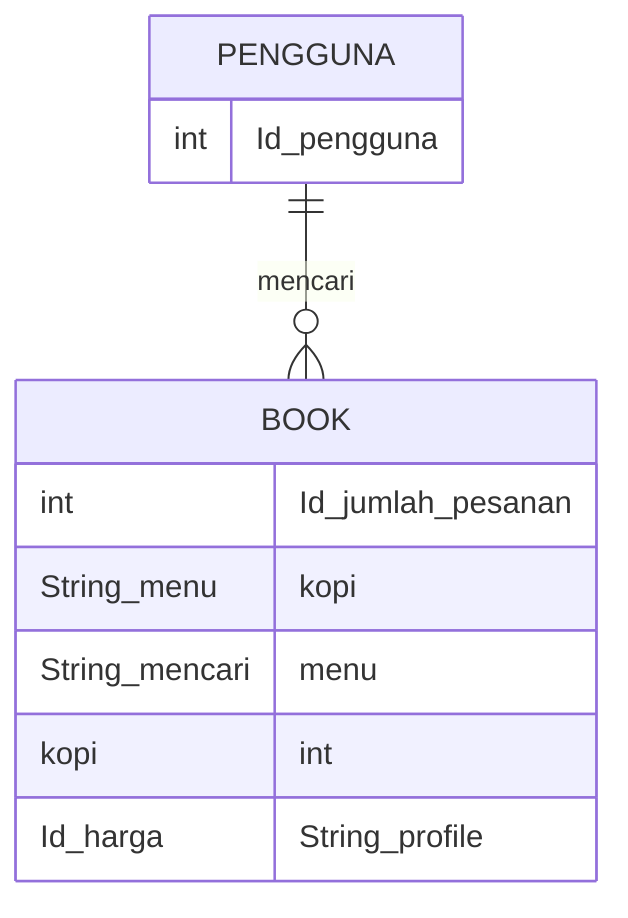
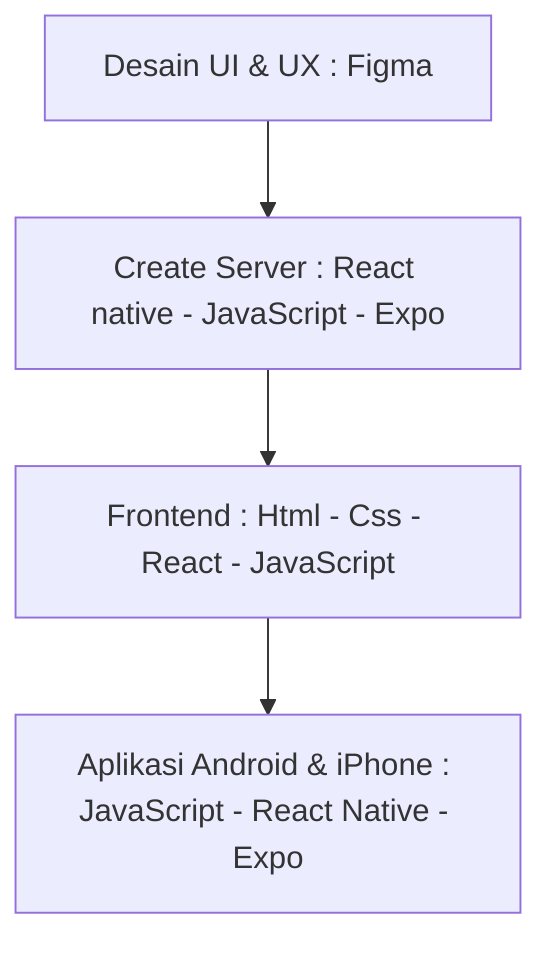

## Membuat App Coffe Shop ( "Nuku Coffe" ) Dengan React Native, Expo
Muhammad Rahardian Baihaqi -oct 25, 2023

## Intro
Coffe shop merupakan suatu tempat yang menyediakan berbaagai jenis kopi atau bahkan minuman atau makanan dengan menyediakan suasana santai, tempat yang nyaman, dan dilengkapi berbagai fasilitas yang menarik dan nyaman. Kata coffe sendiri berasal dari bahasa Prancis kata cafe yang artinya kopi, menoleh kebelakang indonesia merupakan salah satu negara dengan Budaya minum kopi yang banyak digemari atau bahkan sekarang menjadi trend di lingkungan masyrakat, Oleh karena itu peminataanya pun menjadi meningkat yakni 25%-30% pertahunnya, Sehingga Banyaknya Coffe shop/kedai kopi yang mulai padat antrian sehingga menimbulkan dampak mulai pelajar, mahasiswa, hingga orang tua banyak dari mereka yang ingin menikmati kopi lebih santai dan nyaman serta praktis dan tanpa ribet. Dalam kondisi saat ini banyak orang yang ingin membeli kopi dengan santai tanpa harus datang ke Coffe Shop tanpa antrian yang lama dan kurang maksimal dalam pelayananya. Maka dari itu saya membuat Coffe Shop App "Nuku Coffe" dengan adanya aplikasi ini yang tujuan untuk menuruti apa yang diinginkan user yaitu adalah user ingin menimati/membeli kopi tanpa harus ribet antri dan ribet dengan porsi yang sesuai keinginan, sehingga user bisa dapat menikmati kopi lebih cepat tanpa harus ribet antri dan tentunya lebih efisien menghemat waktu.

## Analysis Branding
Di tahap kedua kali ini kita akan mengeksplorasi branding dari aplikasi e-commerce yang dibuat, meliputi :
1. Merk : Nuku Coffe
2. Tagline : Pesan kopi tanpa ribet dan kapanpun dimanapun
3. Campaign : Bagaimana membuat aplikasi yang membuat penggunanya mampu membeli atau bahkan hanya melihat saja suatu menu yang akan dicari
4. Target user : 
   - Usia : 13+
   - Seseorang yang senang membeli suatu menu kopi
   - Seseorang yang ingin membeli menu kopi tanpa menunggu antrian dan ribet
   - Seseorang yang ingin memesan menu kopi secara online
   - Seseorang yang ingin menikmati kopi tanpa harus berada di coffe shop
   - Seseorang yang ingin membeli kopi dimanapun dan kapanpun
   - Seseorang penikmat menu kopi yang ingin mencoba teknologi pesan online
5. User experience theme :
   - Simple
   - Mudah
   - Elegan
   - Ramah
   - Warna  :
     **Hijau tua dan muda** salah satu warna yang identik dengan nuansa warna yang tenang, warna ini akan menyeimbangkan emosional, seperti cinta, kepercayaan, dan kasih sayang. warna        hijau untuk memberikan kesan segar dan dengan mudah kita bisa memberikan nuansa membumi dengan kombinasi warna hijau dan coklat.
     **Coklat** memberi kesan merek yang tenang dan bersahaja dan cukup mewakili produk kopi yang alami
     **Putih** salah satu juga warna yang menunujukkan murni dan keamanan warna ini juga dapat menunjukkan kebersihan, kemurnian, dan kemanan dan dapat digunkan untuk memicu kreatifitas.
     

## 2. Analysis User Story
Pada tahap ketiga kali ini mengeksplorasi kebutuhan prioritas dari pengguna agar kita wujudkan sebagai fitur dalam aplikasi web yg dibuat.

Sebagai | Saya ingin bisa | Sehingga | Prioritas
---|---|---|---
Pengguna| Memilih Menu | Pengguna memilih menu yang apa akan dibeli | ⭐⭐⭐⭐⭐
Pengguna| Memanambahkan nama | pengguna mendapatkan ucapan selamat datang | ⭐⭐⭐
Pengguna| Mengarah Tampilan Home | Pengguna mampu melihat tampilan di Home | ⭐⭐⭐
Pengguna| Memiliki profil | Pengguna mampu merubah profile yang diinginkan | ⭐⭐⭐⭐
Pengguna| Merubah lokasi tempat | Pengguna mampu melihat outlet dan lokasi coffe| ⭐⭐⭐⭐⭐
Pengguna| Melihat notifikasi lonceng | memudahkan untuk memberitahu informasi tentang app coffe | ⭐⭐⭐
Pengguna| Mencari menu | memudahkan memilih menu kopi yang akan dipesan | ⭐⭐⭐⭐⭐
Pengguna| Memilih kategori | memudahkan pemilihan kategori menu kopi | ⭐⭐⭐⭐
Pengguna| Menambahkan menu kopi | memudahkan pemilihan menu kopi untuk pesan secara banyak | ⭐⭐⭐⭐⭐
Pengguna| Melihat detail kopi | pengguna mampu melihat harga, size, level dan about | ⭐⭐⭐⭐
Pengguna| Melihat rating | memberitahu rating menu kopi | ⭐⭐⭐⭐
Pengguna| Menambahkan Favorite | pengguna dapat menyukai menu kopi | ⭐⭐⭐
Pengguna| Menambahkan ke keranjang | pengguna dapat mengetahui barang yang ditambahkan | ⭐⭐⭐⭐
Pengguna| Mengarah Tampilan Favorite | Pengguna mampu mengarah menu favorit dari pengguna | ⭐⭐⭐⭐
Pengguna| Mengarah Tampilan Keranjang | Pengguna mampu melihat menu kopi yang dimasukan keranjang oleh pengguna | ⭐⭐⭐⭐⭐
Pengguna| Mengarah Tampilan Profile | Pengguna mampu melihat profile dari pengguna | ⭐⭐⭐⭐⭐
Pengguna| Menambahkan berapa jumlah menu kopi yang dipesan | Pengguna mampu memesan berapa jumlah menu kopi yang ingin dipesan | ⭐⭐⭐⭐⭐
Pengguna| Mengetahui subtotal | memudahkan berapa harga menu kopi yang harus dibayarkan | ⭐⭐⭐⭐⭐
Pengguna| Memilih payment | Pengguna mampu memilih pembayaran lewat mana saja | ⭐⭐⭐⭐⭐
Pengguna| Membayarkan menu| Pengguna mampu membayar menu yang telah dipesan | ⭐⭐⭐⭐⭐

## 3. Struktur Data

## 4. Design : Arsitektur Sistem

Tahap ini kita merancang sebuah rangkaian teknologi yang digunakan/terdapat pada setiap komponen pembentukan aplikasi.

## 5. Teknologi, Library, dan Framework
Pada tahap ini saya menggunakan berbagai Teknologi seperti React Native, Expo untuk bagian create server. Figma dan Autodraw untuk UI & UX, untuk library menggunakan react navigation, JavaScript, Serta untuk running saya menggunakan framework React dan Expo. 

## 6. Desain User Experience dan User Interface

- Pada tahap ini kita mengeksplorasi alir interaksi pengguna yang paling praktis dan efektif
- Pada design yang saya gunakan adalah **AutoDraw untuk UX** sedangkan untuk **UI menggunakan Figma**.
- Desain diatas termasuk ke dalam low fidelity design dimana kualitas desainnya paling sederhana tapi cepat untuk dibuat untuk **UX** 

