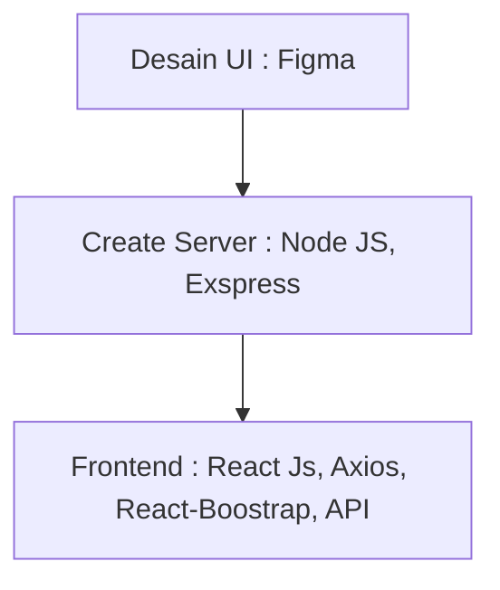

## Membuat Aplikasi Web E-commerce ( Tukatuku.com ) Dengan React Native, Exspress, Node JS dan Bootstrap
Muhammad Rahardian Baihaqi -oct 25, 2023

## Intro
Di tahap pertama ini kita akan melihat bagaimana sebuah teknologi kekinian berbasis online dibuat. E-commerce merupakan suatu konsep baru yang biasa digambarkan
sebagai proses jual beli produk. E-commerce juga merupakan kegiatan suatu bisnis juga yang dapat dikembangkan oleh semua user atau semua orang baik anak kecil sampai orang tua
karena E-commerce ini dijalankan melalui komunikasi digital dengan sangat mudah dipahami, dengan demikian
kita akan membuat sebuah Aplikasi web sederhana seperti E-commerce dimana pengguna dapat membeli, mencari, melihat, menjual sesuatu produk. 

## Analysis Branding
Di tahap kedua kali ini kita akan mengeksplorasi branding dari aplikasi e-commerce yang dibuat, meliputi :
1. Merk : Tukatuku.com
2. Tagline : Kamu jual saya beli
3. Campaign : Bagaimana membuat aplikasi yang membuat penggunanya mampu membeli dan menjual atau bahkan hanya melihat saja suatu produk yang akan dicari
4. Target user :
   - Usia : 10+
   - Seseorang yang senang berbelanja / membeli suatu produk
   - Seseorang yang senang melihat suatu produk
   - Seseorang yang ingin menjual produk karya hasil sendiri
   - Seseorang yang ingin menjual / memasarkan suatu produk
   - Suatu perusahaan yang ingin menjual produk dalam online store
5. User experience theme :
   - Simple
   - Mudah
   - Elegan
   - Ramah
   - Warna  :
     Biru Muda menggunakan warna ini karena warna ini memiliki arti ketenangan, kedamaian, kesegaran, kepercayaan dan juga aman, 
     Putih menggunakan warna ini karena warna ini memiliki arti menunjukan rasa damai dan kesucian, dan kebersihan
   - Inspirasi Design
     
     

## 2. Analysis User Story
Pada tahap ketiga kali ini mengeksplorasi kebutuhan prioritas dari pengguna agar kita wujudkan sebagai fitur dalam aplikasi web yg dibuat.

Sebagai | Saya ingin bisa | Sehingga | Prioritas
---|---|---|---
Pengguna| Memilih Produk | Pengguna memilih produk yang apa akan dibeli | ⭐⭐⭐⭐⭐
Pengguna| Melihat Produk | Pengguna mampu melihat produk yang dijual | ⭐⭐⭐⭐
Pengguna| Membeli Produk | Pengguna mampu membeli produk yang dijual | ⭐⭐⭐⭐⭐
Pengguna| Menjual Produk | Pengguna mampu menjual produk yang akan dijual oleh penjual| ⭐⭐⭐⭐⭐
Pengguna| Memberi Rate Produk | Pengguna mampu membeli rate kepuasaan produk yang dijual | ⭐⭐⭐⭐
Pengguna| Membayar Produk | Pengguna membayar produk yang akan dibeli | ⭐⭐⭐⭐⭐

## 3. Struktur Data

## 4. Design : Arsitektur Sistem

Tahap ini kita merancang sebuah rangkaian teknologi yang digunakan/terdapat pada setiap komponen pembentukan aplikasi web

## 5. Teknologi, Library, dan Framework
Pada tahap ini kita menggunakan berbagai Teknologi seperti React Native, Exspress. serta menggunakan Framework Boostrap, Node JS 

## 6. Desain User Experience dan User Interface

(
)
